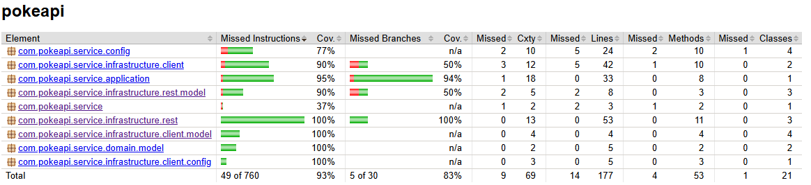

# Pokemon Ranking Service
___
Pokémon Ranking Service provides a RESTful API to access a ranking of Pokémon based on their stats.
The service retrieves Pokémon data from the PokeAPI and ranks them based on their stats.

You can see a **LIVE** version of this service [HERE][1]. Keep in mind that is limited to 300 Pokémon due to the PokeAPI limitations, but you can run it locally with more delay between calls to retrieve more Pokémon.

# Dependencies
___
- Java 21 
- Spring Boot 3.5.3

# Setup 
___
1. Clone the repository.
2. Use the Gradle task `./gradlew bootRun` to build and run the project.

Optional steps:
3. Update the properties `pokeapi.max-limit` and `cache.fixed-delay` to extend the number of Pokémon to retrieve and the cache expiration respectively.
4. By default the loading of the Pokemon data will use a local file as the source data. If you want to use the GCP bucket you'll need login with gcloud in order to use ADC and set the properties: 
   - `gcp.storage.bucket.name` to the name of the bucket.
   - `gcp.storage.file.reference` Path and name of the file in the bucket.

# Testing
___
1. Use the Gradle task `./gradlew test` to run the test suit and generate the jacoco report at `build/reports/jacoco/test/html/index.html`.

Last Jacoco report: 

# Deploy to GCP
1. Authenticate through gcloud `gcloud auth application-default login`.
2. Deploy any changes `gcloud app deploy`

# Justification
___
It has been implemented using a hexagonal architecture, which allows for easy testing and separation of concerns. 

**The folder structure is as follows:**

- **Application dir:** contains the main application logic. 
- **Configuration dir:** contains the configuration classes.
- **Domain dir:** contains the business model logic and interfaces (ports) to connect the application and the infrastructure.
- **Infrastructure dir:** contains the implementation of different adapters to connect the application to the external services (PokeAPI) or expose it to the reception of requests (rest controller).

**Configurations used:**

- **Cache:** since the service required to obtain the data from an external API, a cache was implemented to avoid unnecessary calls to the PokeAPI. 
The default cache expiration is set to 5.5 months. 
- **PokeAPI Client:** a WebClient is used to connect to the PokeAPI and retrieve the Pokémon data. The default limit of Pokémon to retrieve is set to 10, 
but it can be extended by changing the `pokeapi.max-limit` property in the application properties file. The recommended limit is 2000 to consider all Pokémon.
- **Swagger:** a Swagger configuration was included to provide an easy way to test the API endpoints.
- **OpenAPI:** an OpenAPI configuration was included to provide the list of server endpoints (local and LIVE).
- **Jackson:** a Jackson configuration was included to handle the serialization and deserialization of the JSON data.

# Improvements 
___

Update the application service and rest controller to use webflux async instead of blocking calls.

[1]: https://pokemon-ranking-dot-mayeru.oa.r.appspot.com/swagger-ui/index.html